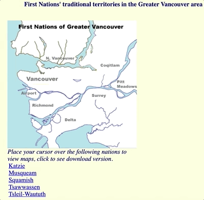

```{r setup, include=FALSE, echo=FALSE}
# Dont modify this chunk
source("rmd_config.R")
knitr::opts_chunk$set(eval=FALSE)
xaringanExtra::use_clipboard(
  button_text = "Copy",
  success_text = "Copied",
  error_text = "Press Ctrl + C to copy"
)
```

```{r css-extras, file="css-extras.R", echo=FALSE}
# Dont remove this
```

# Land acknowledgement

.pull-left[
**I would like to acknowledge that I work on the traditional, ancestral, and unceded territory of the Coast Salish Peoples, including the territories of the xwməθkwəy̓əm (Musqueam), Skwxwú7mesh (Squamish), Stó:lō and Səl̓ílwətaʔ/Selilwitulh (Tsleil- Waututh) Nations.**

*Traditional*: Traditionally used and/or occupied by Musqueam people

*Ancestral*: Recognizes land that is handed down from generation to generation

*Unceded*: Refers to land that was not turned over to the Crown (government) by a treaty or other agreement

]

.pull-right[
.center[]
]

---

# Title is not required

To render this, use `xaringan::infinite_moon_reader()`
- You will then see something in your `viewer` panel
- .secondary[Note: the render on github could take sometime]
- If you want to check the latest commit do:
`https://domain_of_your_website?version=commit`

--

Use `---` to separate page
- You need to break lines between `---`, **NO space after it**

Use `--` to show something after clicking the arrow button `<-` or `->`

--

This is shown after you click it

- use `.pull-left[ ... content goes here]` and `.pull-right[... content goes here]` to have divided columns, for example:

--

.pull-left[
- This is shown to the left
- To make emphasis message use `.emphasis[]`

.emphasis[
This is emphasised]

]


.pull-right[
- This is shown to the right
- To make alert message use `.alert[]`

.alert[This is alerted]
]

---

class: middle, center

.tertiary[.larger[To see more tags available, checkout the `materials/slides-style.css` file]]

---


class: middle, center
background-image: url(materials/img/website_bkg.png)
background-position: top
background-size: contain

<br><br>
.secondary[.center[.larger[Thanks!]]]

Slides created via the R package [**xaringan**](https://github.com/yihui/xaringan).

Credits to:

  [Stat 406 Lecture Slides @DJM](https://ubc-stat.github.io/stat-406/)

<br><br>

.secondary[.center[.larger[Questions?]]]
